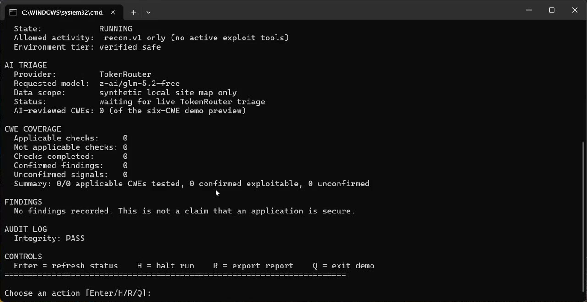
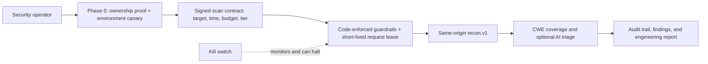

# Sentinel


[](https://skillicons.dev)


<div align="center">

**Governed AI-assisted web-security testing — built for customer control, not blind automation.**

[](#quickstart)
[](#run-the-demo)
[](#what-runs-today)
[](#what-runs-today)

</div>

> **Sentinel helps security teams answer one practical question:** “What should we review first?”
> It proves control of a target, binds activity to a short permission contract, maps the approved
> surface, and uses AI only to prioritize engineering review.

<p align="center">
  <a href="https://github.com/sohan-a11y/sentinel/releases/download/demo-2026-07-18/sentinel-cli-ai-demo-2min.mp4">
    
  </a>
</p>

<p align="center">
  <strong><a href="https://github.com/sohan-a11y/sentinel/releases/download/demo-2026-07-18/sentinel-cli-ai-demo-2min.mp4">&#9654; Watch the two-minute Sentinel CLI demo</a></strong>
  <br>
  Local target only &middot; TokenRouter AI triage &middot; No active exploit tools
</p>

**Jump to:** [Run the demo](#run-the-demo) · [What runs today](#what-runs-today) · [Architecture](#architecture) · [Security controls](#what-the-current-mvp-enforces) · [Detailed docs](#learn-more)

## Why Sentinel

| Traditional automated scanner | Sentinel |
|---|---|
| Starts with a URL and scans | Starts with ownership proof and an approved contract |
| Mixes suggestions with findings | Keeps AI triage, evidence, and confirmed findings separate |
| Safety depends on operator discipline | Enforces target, tier, rate, halt, and audit boundaries in code |
| Often gives a long report with little context | Shows coverage, scope, audit health, and the next engineering action |

## Run the demo

The project is **CLI-first**. No web dashboard is required.

1. Double-click [`Start Sentinel Demo.cmd`](Start%20Sentinel%20Demo.cmd) for a safe local demo.
2. Double-click [`Start Sentinel AI Demo.cmd`](Start%20Sentinel%20AI%20Demo.cmd) for the optional
   TokenRouter AI preview. If no key is configured, it asks for one with hidden input and never
   writes it to the repository.
3. Use `Enter` to refresh, `H` to halt, `R` to export a report, or `Q` to exit.

The demo fixes the target at `https://127.0.0.1`. It creates a disposable local HTTPS site, proves
control of it, and records the run in a local audit log. The AI mode sends only the synthetic local
site-map summary to TokenRouter — never customer credentials, request bodies, database records, or
session tokens.

## What runs today

| Included in a contract run | Deliberately blocked in a contract run |
|---|---|
| Ownership proof and environment checks | Nuclei active templates |
| Same-origin `recon.v1` mapping | ZAP active scanning |
| CWE applicability and AI-assisted triage | IDOR manipulation and live verification |
| Manual halt, request leases, audit records, Markdown report | Payload generation and proof-of-concept exploitation |

AI assists with **CWE relevance triage**. It cannot select a target, expand the approved scope,
change a contract, or execute an exploit. Zero findings are never presented as proof that an
application is secure.

> [!WARNING]
> This is a prototype and local demo environment, not a customer-ready production service. A
> production release still needs tenant-scoped identity, independently authenticated approvals, a
> mandatory DNS/IP-aware egress proxy, and durable multi-worker infrastructure.

## How Sentinel works



Every stage is traceable. The LLM is a bounded reasoning component inside the workflow — never the
authority that decides where or how the system may test.

## Learn more

- [Two-minute demo video script](docs/product/demo-video-script.md)
- [Local demo runbook](docs/product/local-demo-runbook.md)
- [Business-ready architecture](docs/product/business-architecture.md)
- [Authorization and safety control plane](docs/product/authorization-control-plane.md)
- [Zero-trust customer-hosted runner guide](docs/product/zero-trust-customer-runner.md)

## Architecture

```
                         ┌─────────────────────────────────────────┐
                         │  PHASE 0 — cannot be disabled by config  │
                         │  1. Domain ownership (HTTP/DNS token)    │
                         │  2. Environment canary (live probe)      │
                         │  3. Registration record (SQL, audited)   │
                         └───────────────────┬───────────────────┘
                                             │ start_scan_session()
                                             ▼
                         ┌─────────────────────────────────────────┐
                         │        sentinel.security.guardrails      │◄──── every agent below
                         │  enforce_target_authorized / _tier /     │      calls into this,
                         │  _no_pivot / _not_halted /                │      not around it
                         │  _demonstration_budget                   │
                         └───────────────────┬───────────────────┘
                                             │
    ┌───────────────┬────────────────────────┼────────────────────────┬───────────────┐
    ▼               ▼                        ▼                        ▼               ▼
 Agent 1         Agent 2                  Agent 3                 Agent 4         Agent 5
 Recon      CWE Mapping Agent          Dispatcher            Verification      Report Agent
 (crawl,    (150-250 web-relevant   ┌───────────────┐        (independent    (dashboard,
  fingerprint)  CWEs, applicable/    │ nuclei_wrapper │        re-check via    markdown/PDF
                not-applicable +     │ zap_wrapper    │        a 2nd method    export)
                reason)              │ idor_agent     │        before
                                     │  (CWE-639,     │        "confirmed")
                                     │   LLM-driven)  │
                                     └───────────────┘

                         ┌─────────────────────────────────────────┐
                         │   Agent 6 — Kill Switch Monitor           │
                         │   Runs alongside everything above:        │
                         │   watches error-rate/latency, auto-halts,  │
                         │   exposes the ONE human touchpoint after   │
                         │   Phase 0 (manual halt), writes an          │
                         │   immutable hash-chained audit log entry   │
                         │   for every halt, automatic or manual.     │
                         └─────────────────────────────────────────┘
```

All six agents are [LangGraph](https://github.com/langchain-ai/langgraph) nodes sharing one state
object, [`SentinelState`](sentinel/agents/state.py) — the single contract every module in this
build agreed on, which is what let recon/cwe-mapping/nuclei/zap/idor/verification/report get
built independently and land without merge conflicts. The graph itself
([`sentinel/agents/graph.py`](sentinel/agents/graph.py)) is:

```
recon -> cwe_mapping -> dispatch -> sync_cwe_checklist -+-(halted)-> finalize_halted -+-> persist_findings -> report -> END
                                                          +-(clean)-> verification    -+
```

If the kill switch trips mid-dispatch, the conditional edge routes straight to
`finalize_halted` instead of `verification` — verification makes its own live requests to the
target to independently re-check findings, so running it after a halt would violate the halt it's
supposed to respect. Raw findings from before the halt are kept and demoted to `unconfirmed`
rather than lost.

The diagram describes the repository's broader agent graph. A contract-started run is restricted
to `recon.v1`: it may collect same-origin HTTPS metadata and produce coverage/reporting state, but
it does not send Nuclei, ZAP, IDOR, or verification traffic.

## What the current MVP enforces

| Boundary | Enforced by | What happens if violated |
|---|---|---|
| Scan only registered, ownership-verified domains | `guardrails.enforce_target_authorized` reading `target_registrations` | `UnauthorizedTargetError`, scan action never sent |
| Contract recon cannot follow a discovered off-origin link or use a non-HTTPS target URL | `recon_agent` plus `control_plane.reserve_recon_request` | Link is recorded or the request is rejected before egress |
| Contract runs cannot enable Tier B, Nuclei, ZAP, IDOR, or live verification | Tier-A-only contract validation plus dispatcher/verification guards | Contract policy error or an empty, audited engine result; no scanner request is sent |
| A halted scan cannot keep dispatching, even from a different thread/session | `guardrails.enforce_not_halted` re-reads the DB (`db.refresh`) on every check rather than trusting a possibly-stale in-memory flag | `ScanHaltedError` |
| Contract policy and execution decisions are recorded | HMAC-signed contract policy plus a hash-chained audit log | Contract integrity failure blocks execution; audit verification checks chain continuity. Configure `SENTINEL_AUDIT_LOG_HMAC_KEY` to resist a database writer recomputing the chain |
| All `/api` routes require a configured shared API key | `sentinel.api.deps.require_api_key` | `503` if `SENTINEL_API_KEY` is unset; `401` for a missing/invalid bearer token |
| Contract-backed execution requires an independent signing key | `sentinel.control_plane.service` verifies an HMAC-signed policy | Contract creation or execution fails closed if `SENTINEL_CONTROL_PLANE_SIGNING_KEY` is unset or the policy integrity check fails |

None of this is "ask the LLM nicely." `tests/test_guardrails.py::test_no_scan_flag_or_config_can_bypass_this`
asserts, by inspecting function signatures, that no `enforce_*` function even accepts a
force/override/skip parameter.

The shared API key is not tenant identity, and it does not make `approved_by` an independently
authenticated approval. `/api` routes fail closed without the key, but a single global credential
cannot provide per-organization or per-asset authorization. URL checks and per-request leases are
also not a substitute for an external DNS/IP-aware egress proxy, so they do not close DNS
rebinding or direct-network-path risks.

### Independent security review

Before calling this done, a security-reviewer pass was run specifically against the boundary files
(`phase0/`, `security/guardrails.py`, `security/audit_log.py`, `kill_switch.py`, `idor_agent.py`,
`dispatcher_agent.py`, `graph.py`, and the API routes) — not the whole codebase, just the parts
that constrain unattended execution. Its findings drove the fixes and release blockers below:

1. **Redirect-based pivot** (critical) — `follow_redirects=True` in Phase 0 and the IDOR agent let
   a target's `Location:` header carry the request (and an attached session cookie) to an
   unvalidated host. Fixed by `safe_http.py`, which walks redirects manually and re-validates the
   host at each hop. See `tests/test_safe_http.py::test_does_not_leak_cookies_to_off_host_redirect_target`.
2. **Stale halt check across sessions** (critical) — `enforce_not_halted` read an in-memory flag
   that a manual API halt (a different DB session/thread than a long-running dispatch loop) would
   never update. Fixed by refreshing from the DB on every check. See
   `tests/test_guardrails.py::test_picks_up_a_halt_committed_by_a_different_session`.
3. **No caller identity or tenant isolation** (high, **not production-ready**) — Phase 0 verifies
   domain control, not the caller. All `/api` routes now fail closed unless a shared
   `SENTINEL_API_KEY` is configured, but that key neither identifies an organization nor binds an
   approver to an asset. `approved_by` is only a stored label. Tenant identity, per-asset
   authorization, and independently authenticated approval are release blockers.
4. **Demonstration budget wasn't persistent** (high) — `enforce_demonstration_budget` compared a
   caller-supplied count against the cap, so it always "passed"; nothing tracked prior creations.
   Fixed with a lifetime counter on `TargetRegistration`. See
   `tests/test_idor_agent.py::test_demo_account_budget_is_actually_persistent_across_two_real_calls`.
5. **Audit log forgeable with DB access alone** (medium-high, **not production-ready by
   default**) — plain SHA-256 means anyone who can edit a row can also recompute the chain forward
   with the same public function. `SENTINEL_AUDIT_LOG_HMAC_KEY` provides a mitigation when it is
   kept outside the database, but production must make this key and a remote audit anchor
   mandatory.
6. **Scheme confusion** (medium) — `normalize_host` compared only hostnames, so
   `file://example.com/etc/passwd` normalized identically to the real target and relied on httpx's
   own scheme rejection (not this codebase's boundary) to actually stay safe. Fixed by rejecting
   non-http(s) schemes explicitly.
7. **Audit log write lock is process-local** (low, **not fixed**) — `threading.Lock` doesn't
   coordinate across multiple worker processes. Run Sentinel as a single process, or accept that
   `verify_chain()` may report a false-positive "chain broken" under multi-worker races (it will
   never silently miss real tampering, only occasionally flag benign concurrency as suspicious).
   A real fix needs a DB-level advisory lock (e.g. Postgres `pg_advisory_lock`) and was out of
   scope for this pass.

## Phase 0 — Authorization & Environment Verification

Two independent checks, both fail-closed (any network error, timeout, or missing token means
"not verified" — never "verified by default"):

1. **Domain ownership.** `sentinel/phase0/verification.py`. Place the token Sentinel generates at
   `https://{domain}/.well-known/sentinel-auth.txt`, **or** as a DNS TXT record at
   `_sentinel-verify.{domain}`. Either is sufficient.
2. **Environment canary.** `sentinel/phase0/canary.py`. Seed the UUID Sentinel generates into your
   target's own database (a throwaway test-user row is enough), and give Sentinel a URL template
   (containing the literal placeholder `{marker}`) that reads it back. This is re-probed **fresh,
   live, every scan session** — a prior pass is never trusted. If the marker doesn't come back,
   the whole session is silently downgraded to Tier A (read-only) regardless of what the caller
   claims, and that downgrade is written to the audit log.

`sentinel/phase0/registry.py` ties both together: `register_target()` creates an unverified row,
`run_ownership_verification()` proves the token is present, and `start_scan_session()` re-runs the
canary before stamping a new `ScanSession`. The contract service performs a fresh ownership proof
and fresh canary immediately before it binds the lease for a run.

All `/api` routes fail closed until `SENTINEL_API_KEY` is configured. Contract creation and
contract-backed execution also require `SENTINEL_CONTROL_PLANE_SIGNING_KEY`; configure both
secrets before using the API (use a secret manager in any non-local environment):

```bash
export SENTINEL_API_KEY='local-development-secret'
export SENTINEL_CONTROL_PLANE_SIGNING_KEY='separate-local-development-secret'
```

Register via the API. With `SENTINEL_API_KEY` configured, send the bearer header on every API
request below:

```bash
curl -X POST http://localhost:8000/api/targets/register \
  -H "Content-Type: application/json" \
  -H "Authorization: Bearer $SENTINEL_API_KEY" \
  -d '{
    "domain": "staging.yourcompany.com",
    "account_owner": "you@yourcompany.com",
    "canary_check_url_template": "https://staging.yourcompany.com/api/internal/canary/{marker}"
  }'
# -> { "verification_token": "...", "canary_marker": "...", ... }

# place the token per the response's instructions, then:
curl -X POST http://localhost:8000/api/targets/staging.yourcompany.com/verify \
  -H "Authorization: Bearer $SENTINEL_API_KEY"
```

Then create a signed Tier-A contract and start it by contract ID. Contract execution fails closed
when either `SENTINEL_API_KEY` or `SENTINEL_CONTROL_PLANE_SIGNING_KEY` is absent. The current
`approved_by` field is an audit label supplied by the caller, not a verified approver identity.

```bash
curl -X POST http://localhost:8000/api/contracts \
  -H "Content-Type: application/json" \
  -H "Authorization: Bearer $SENTINEL_API_KEY" \
  -d '{
    "domain": "staging.yourcompany.com",
    "approved_by": "security-approver@yourcompany.com",
    "customer_authorization_reference": "approved-test-window-ticket-2026-07-18",
    "allowed_tier": "tier_a",
    "expires_at": "2027-01-01T00:00:00Z",
    "max_scan_sessions": 1,
    "max_requests": 100
  }'
# -> { "contract_id": 1, ... }

# Development/operator-only: creates a short-lived local runner permit.
# Do NOT give SENTINEL_API_KEY to a customer runner. Its pinned issuer public
# key must be provisioned through a separate approved onboarding channel.
# This endpoint is disabled by default; this explicit setting is only for a
# development deployment, never a customer or production deployment.
export SENTINEL_DEPLOYMENT_MODE=development
export SENTINEL_ENABLE_DEVELOPMENT_RUNNER_PERMIT_ISSUANCE=true
curl -X POST http://localhost:8000/api/contracts/1/runner-permits \
  -H "Content-Type: application/json" \
  -H "Authorization: Bearer $SENTINEL_API_KEY" \
  -d '{"allowed_path_prefixes":["/api/","/health"]}'
# -> { "issuer_key_id": "...", "permit": { ... } }

curl -X POST http://localhost:8000/api/contracts/1/runs \
  -H "Authorization: Bearer $SENTINEL_API_KEY"
# -> { "scan_session_id": 1, "recipe": "recon.v1", ... }

curl http://localhost:8000/api/scans/1 -H "Authorization: Bearer $SENTINEL_API_KEY"
curl http://localhost:8000/api/scans/1/findings -H "Authorization: Bearer $SENTINEL_API_KEY"
curl -X POST http://localhost:8000/api/scans/1/halt \
  -d '{"reason": "stopping early"}' -H "Content-Type: application/json" \
  -H "Authorization: Bearer $SENTINEL_API_KEY"
```

`/api/scans/start` now returns 410 Gone so no public free-form domain can bypass the
contract. The current recipe is `recon.v1`: same-origin HTTPS crawl plus metadata collection,
with every target request reserved against the lease budget immediately before egress.

Existing local databases are upgraded additively at startup for the new session bindings. This is
an MVP convenience, not a production migration strategy: use Alembic, PostgreSQL, a durable job
queue, and distributed coordination before enabling concurrent workers.

## The six agents

This is a code inventory, not the contract-run permission set. In the current control plane only
Recon is allowed to make target requests; the dispatcher blocks Nuclei, ZAP, and IDOR, and the
verification agent does not perform live rechecks for a contract run.

1. **Recon** ([`sentinel/agents/recon_agent.py`](sentinel/agents/recon_agent.py)) — same-origin
   crawl (off-target links are recorded, never followed), endpoint/form/param/cookie mapping,
   tech-stack fingerprinting from headers, cookies, error pages, and JS bundles — no external
   scraping dependency, just `html.parser`.
2. **CWE Mapping** ([`sentinel/agents/cwe_mapping_agent.py`](sentinel/agents/cwe_mapping_agent.py))
   — a curated, web-application-relevant slice of the CWE catalog
   ([`sentinel/cwe/data/cwe_web_relevant.json`](sentinel/cwe/data/cwe_web_relevant.json), refreshable
   from the live MITRE catalog via `scripts/fetch_cwe_data.py`), cross-referenced against the recon
   site map — rule-based where the answer is deterministic (no upload form → CWE-434 not
   applicable), LLM-reasoned where it isn't.
3. **Detection Dispatcher** ([`sentinel/agents/dispatcher_agent.py`](sentinel/agents/dispatcher_agent.py))
   — routes the checklist across:
   - [`nuclei_wrapper.py`](sentinel/agents/dispatch/nuclei_wrapper.py) — Tier A, template-based
     (dos/fuzz tags excluded by construction).
   - [`zap_wrapper.py`](sentinel/agents/dispatch/zap_wrapper.py) — spider + passive scan (Tier A),
     active scan (Tier B, gated on the canary tier).
   - [`idor_agent.py`](sentinel/agents/dispatch/idor_agent.py) — the differentiator: an
     LLM-driven CWE-639 (IDOR) agent that reasons over the *specific* site's endpoints to generate
     per-endpoint test strategies dynamically, rather than trying one fixed manipulation against
     everything.
4. **Verification** ([`sentinel/agents/verification_agent.py`](sentinel/agents/verification_agent.py))
   — every raw finding is re-checked by a method genuinely different from the one that produced
   it before being marked `confirmed`. Anything that fails re-verification becomes `unconfirmed —
   needs review`, never silently dropped.
5. **Report** ([`sentinel/agents/report_agent.py`](sentinel/agents/report_agent.py) +
   [`sentinel/dashboard/app.py`](sentinel/dashboard/app.py)) — the headline metric is always
   `X/Y applicable CWEs tested, Z confirmed exploitable, W unconfirmed`. Live Streamlit dashboard,
   Markdown/PDF export.
6. **Kill Switch Monitor** ([`sentinel/agents/kill_switch.py`](sentinel/agents/kill_switch.py)) —
   runs throughout, not sequentially. Tracks rolling error-rate/latency per scan session and
   auto-halts on anomaly; exposes the one human touchpoint after Phase 0
   (`POST /api/scans/{id}/halt`); every halt (automatic or manual) is written to the immutable
   audit log before this module returns control.

## Quickstart

```bash
python -m venv .venv && .venv/Scripts/activate   # or source .venv/bin/activate on Linux/macOS
pip install -r requirements.txt
cp .env.example .env   # fill in SENTINEL_ANTHROPIC_API_KEY (or SENTINEL_OPENAI_API_KEY)

pytest tests/ -q                     # 200+ tests: foundation, every agent, the full graph
                                      # end-to-end, and a security-review regression suite —
                                      # all mocked, no live nuclei/ZAP/network needed

uvicorn sentinel.api.main:app --reload --port 8000     # REST API
streamlit run sentinel/dashboard/app.py                 # live dashboard
```

### Local test lab (a target you actually own: your own Docker containers)

```bash
cd docker && docker compose up -d       # OWASP Juice Shop on :3000, ZAP daemon on :8080, Postgres on :5432
```

That compose stack is for local development only; it is not itself a valid contract target because
the contract/recon boundary requires HTTPS on port 443. To demonstrate the real contract workflow
against it, follow the [Local Demo Runbook](docs/product/local-demo-runbook.md). It puts a
fictional `.test` hostname on loopback behind local TLS, then uses the same authorization gate as
any other permitted target.

Nuclei is a separate binary (not a Python package) — install per
[projectdiscovery.io/nuclei](https://github.com/projectdiscovery/nuclei#install-nuclei) and set
`SENTINEL_NUCLEI_BINARY_PATH` if it's not on `PATH`. If it isn't installed, `nuclei_wrapper.py`
logs `nuclei_unavailable` to the audit log and returns no findings rather than crashing the
dispatcher — the rest of the pipeline (ZAP, IDOR agent, CWE mapping) still runs.

## How this was built

Every agent module past Phase 0 was built by an independent AI subagent, in parallel, against a
fixed set of shared contracts written first and never touched by the parallel agents:

- [`sentinel/agents/state.py`](sentinel/agents/state.py) — the LangGraph state shape
- [`sentinel/db/models.py`](sentinel/db/models.py) — the SQL schema
- [`sentinel/security/guardrails.py`](sentinel/security/guardrails.py) — the boundaries
- [`sentinel/security/audit_log.py`](sentinel/security/audit_log.py) — the audit trail
- [`sentinel/llm/client.py`](sentinel/llm/client.py) — the one place LLM calls happen

Each scan-engine module (nuclei/zap/idor) additionally agreed on one function signature —
`run(db, scan_session, registration, cwe_items) -> list[RawFinding]` — which is what let
`dispatcher_agent.py` route across all three without any adapter code. Every module shipped with
its own pytest suite, mocking subprocess/HTTP boundaries (respx for httpx, `unittest.mock` for
`subprocess`) so the full suite runs with no live nuclei/ZAP/network dependency.

Two real bugs this process caught are worth calling out, because both are the specific failure
mode of building independently-tested modules in parallel: every module's own unit tests passed,
and the bug only showed up once the pieces were run together.

1. **The audit log's hash chain didn't actually verify.** The first version of `audit_log.py`
   computed the hash over a timestamp that was never the one actually stored — SQLite silently
   drops timezone info when a `DateTime(timezone=True)` column gets re-queried inside the same
   session, so a freshly-computed hash and a re-fetched row's recomputed hash disagreed even
   though nothing had been tampered with. Fixed by storing the timestamp as the exact ISO string
   that was hashed, not as a `DateTime` column at all — caught by
   `tests/test_audit_log.py::test_verify_chain_passes_for_untouched_log` failing on entirely
   untouched data.
2. **Verification would have silently rubber-stamped every finding "unconfirmed."** Agent 4
   (verification) was built against an assumed `poc_evidence` format —
   `"matched-at: X\npattern: Y"` key/value lines — and its own unit tests supplied exactly that
   format, so they all passed. But `nuclei_wrapper.py`, `zap_wrapper.py`, and `idor_agent.py` were
   each built by a different parallel agent and produced human-readable prose instead
   (`"template-id | url | extracted=..."`, `"Baseline GET ... Manipulated GET ..."`). Real findings
   from any of the three would have hit verification's `poc_evidence` parser, found none of the
   expected keys, and — worst case, for IDOR — returned `"poc_evidence missing manipulated-url/
   unauthorized-marker; cannot re-probe"` for every single confirmed-worthy finding, undermining
   the platform's flagship feature. This surfaced only when
   [`tests/test_graph.py`](tests/test_graph.py) ran the full pipeline end-to-end with each engine's
   *actual* output shape. Fixed by having each wrapper additionally emit the specific `key: value`
   lines verification needs, and by making the IDOR marker check optional (idor_agent's detector is
   shape/status based, not a single reproducible substring, so verification now re-applies the same
   shape heuristic on a fresh reprobe when no marker is present) — see
   `tests/test_verification_agent.py::TestCustomIdorVerificationWithoutMarker` for the regression
   test.

The lesson generalizes: parallel-built modules need an end-to-end test exercising real output
shapes, not just each module's own mocked unit tests, before you can trust the seams between them.

## Repository layout

```
sentinel/
  phase0/                  domain ownership + canary verification, registration workflow
  security/                guardrails.py (hard boundaries) + audit_log.py (hash-chained log)
  db/                      SQLAlchemy models + session factory
  agents/
    state.py               the shared LangGraph state contract
    graph.py                LangGraph wiring (recon -> ... -> report, with halt routing)
    recon_agent.py           Agent 1
    cwe_mapping_agent.py      Agent 2
    dispatcher_agent.py       Agent 3 orchestration + kill-switch traffic feed
    dispatch/                 nuclei_wrapper.py, zap_wrapper.py, idor_agent.py
    verification_agent.py    Agent 4
    report_agent.py          Agent 5
    kill_switch.py           Agent 6
    persistence.py           state <-> DB sync points (CweApplicability, Finding rows)
  cwe/                     curated CWE dataset + applicability mapping
  llm/                     single LLM client wrapper (Anthropic/OpenAI)
  api/                     FastAPI app + routes (targets, scans, kill-switch)
  dashboard/               Streamlit live dashboard
scripts/
  fetch_cwe_data.py        refresh the CWE dataset from the live MITRE catalog
docker/
  docker-compose.yml       Juice Shop + ZAP + Postgres local test lab
tests/                     one test file per module + tests/test_graph.py end-to-end,
                           every external boundary mocked
```


---

<div align="center">

**Built by [M Sai Sohan (@sohan-a11y)](https://github.com/sohan-a11y)**

*If you find this project useful, please consider giving it a ⭐ on GitHub!*

</div>
