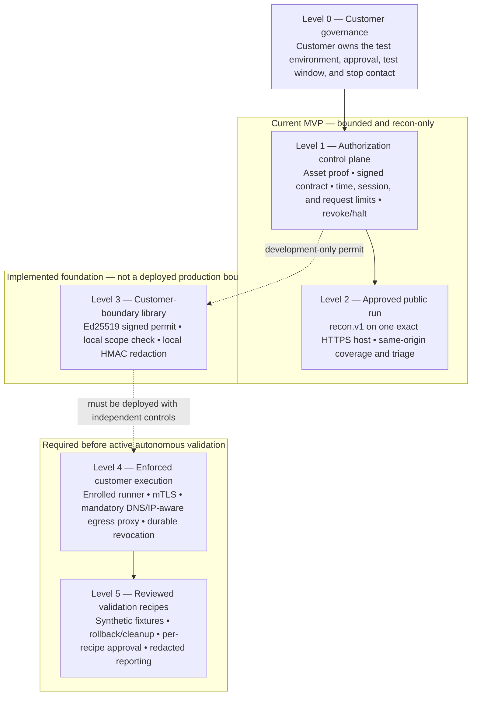

# Sentinel: Business Architecture and Customer Operating Model

## The honest headline

Today, Sentinel is a **controlled web-application recon and coverage/triage MVP**. A public,
contract-backed run can map the approved HTTPS application surface within a fixed scope and budget.
It is **not** yet an autonomous pentesting service, a production zero-trust deployment, or a
system that can claim confirmed exploit findings.

That distinction is deliberate. The product is being built so that customer authorization, test
scope, privacy, and an emergency stop are engineering controls—not promises in an email.

## Architecture, level by level

| Level | What it does | Business meaning today |
|---|---|---|
| 0. Customer governance | The customer approves the target, window, environment owner, and emergency contact. | Sentinel does not treat an instruction as permission to test any host. |
| 1. Authorization control plane | Verifies asset control, creates a signed contract, limits time/sessions/requests, and supports revoke or halt. | A run is bounded before it starts. |
| 2. Public execution | Runs `recon.v1` against the exact approved HTTPS host on port 443. | The current sellable capability is recon, coverage mapping, and triage—not exploitation. |
| 3. Privacy foundation | Issues a locally verifiable signed permit and can make a customer-keyed redacted finding envelope. | Useful building blocks, but not yet an independently enforced customer deployment. |
| 4. Enforced customer execution | Would put an enrolled runner behind customer-controlled identity and a mandatory egress boundary. | This is the missing safety layer required before active validation. |
| 5. Reviewed validators | Would run individual approved test recipes using synthetic fixtures, cleanup, and redacted reporting. | Active testing must be introduced recipe by recipe, never as an unrestricted "scan everything" switch. |

## A simple customer procedure

1. **Prepare a test environment.** The customer selects a UAT/staging environment they control,
   uses approved synthetic or masked data, and keeps credentials in their own vault. Sentinel
   should not receive passwords, session tokens, database contents, or source code.
2. **Authorize a bounded engagement.** The customer's authorized security owner records the exact
   hostname, owner, time window, rate/budget, emergency-stop contact, and confirmation that this
   is an approved test environment. The customer retains the underlying approval record; Sentinel
   can retain a reference to it, not the customer’s secrets.
3. **Prove control of the target.** The customer completes the ownership proof and environment
   canary for the approved host. A new run re-checks those signals.
4. **Run the currently supported service.** Sentinel performs the signed, contract-bound
   `recon.v1` run only. The customer can revoke the contract or halt the run if conditions change.
5. **Review the report as triage.** The result identifies mapped surface and areas needing review;
   it is not a claim that an exploit was demonstrated. The customer prioritizes remediation and
   decides whether a qualified human assessment is needed.
6. **Expand only after the next safety phases.** Active validation will require the independently
   enforced customer runner, a scoped recipe, synthetic test fixtures, and a separate approval.

## Why a customer would use Sentinel

- **Bounded testing instead of open-ended scanning.** Scope, time, and request budget are set
  before a run and cannot be widened by an AI prompt or scanner output.
- **A clear customer control point.** Ownership proof, a contract, and halt/revocation are visible
  parts of the operating process.
- **A path to privacy-preserving validation.** The intended model keeps secrets and raw traffic in
  the customer environment and uses redacted evidence for reporting and remediation.
- **Useful developer prioritization.** Coverage and triage can direct teams toward the parts of an
  application that deserve remediation or expert testing without overstating certainty.

## Data and privacy boundary

The target product boundary is simple: **credentials, raw traffic, database records, session
tokens, and source code stay with the customer.** Sentinel should receive only approved scope,
authorization metadata, run-health signals, and redacted finding context required for reporting.

The current code has an important limitation: its signed-permit and local-redaction components are
library foundations. They are not yet wired through every legacy scanner, log, queue, or storage
path, and there is no deployed mandatory customer-side network proxy. Therefore the MVP must not
be used as proof of an end-to-end redacted-only or production zero-trust data flow. Customers
should not use it against sensitive production traffic.

An approval statement that the environment uses dummy APIs or credentials is valuable governance,
but it does not replace technical controls. Real external routes, message queues, storage,
third-party services, and misconfigured credentials can still cause harm. The future egress and
runner boundary is what makes that procedure enforceable without requiring the customer to hand
over secrets.

## What is available now—and what is not

| Available in the MVP | Not available / not a claim |
|---|---|
| Asset ownership proof and an environment canary | Tenant-scoped identity, independently authenticated approvals, or customer-runner enrollment |
| A signed Tier-A contract with expiry, session/request budgets, contract revoke, and run halt | A production-ready zero-trust environment or a mandatory proxy/network namespace |
| Exact-host, same-origin HTTPS `recon.v1` coverage and triage | Autonomous active pentesting, unrestricted crawling, or arbitrary customer-network access |
| Development-only Ed25519 permit issuance, offline local checking, and customer-keyed local redaction primitives | Durable shared permit redemption, revocation delivery, multi-runner budgets, or mTLS |
| Scanner code may exist in the repository | Contract-run use of Nuclei, ZAP, IDOR testing, or live verification; these are blocked |
| AI-assisted interpretation within the approved workflow | Confirmed exploit claims, a substitute for expert testing, or a guarantee that an application is secure |

## Delivery roadmap

### Phase 1 — Make the execution boundary real

Deploy a customer-enrolled runner with tenant identity and mTLS. Put every outbound test request
behind a mandatory DNS/IP-aware egress proxy that enforces scope, rate, budget, and revocation.
Remove any direct network route around that boundary.

### Phase 2 — Make privacy and operations durable

Use customer-held vault integration, isolated ephemeral workers, secure cleanup, durable shared
state, cancellation/revocation delivery, and a reporting path proven to persist redacted evidence
only. Add real tenant authorization and independently authenticated approval records.

### Phase 3 — Add active validation safely

Introduce reviewed test recipes one at a time, beginning with low-risk, customer-approved checks.
Each recipe needs synthetic identities/fixtures where applicable, rate and concurrency limits,
rollback or cleanup behavior, a separate approval, and clear reporting of *executed*, *unverified*,
and *confirmed* results. Nuclei, ZAP, IDOR, and live verification are candidates for this phase—not
current public-run capabilities.

### Phase 4 — Continuous, customer-governed assurance

Connect approved application/API specifications and deployment changes to scoped retests,
developer evidence packs, and approved ticketing/SIEM integrations. This remains governed by the
same customer-owned scope and stop controls.

## Decision guide for business stakeholders

Position the current MVP as a **controlled recon and coverage/triage pilot**. Do not sell it as
"fully autonomous pentesting," "production zero trust," or a replacement for a qualified security
assessment. The credible differentiation is the roadmap: customer-controlled execution, bounded
authority, privacy-preserving evidence, and progressively enabled validation once independent
technical controls exist.

For implementation details and release blockers, see the [Authorization and Safety Control
Plane](authorization-control-plane.md) and [Zero-Trust Customer-Hosted
Runner](zero-trust-customer-runner.md). The repository's operational setup remains in the
[README](../../README.md).
